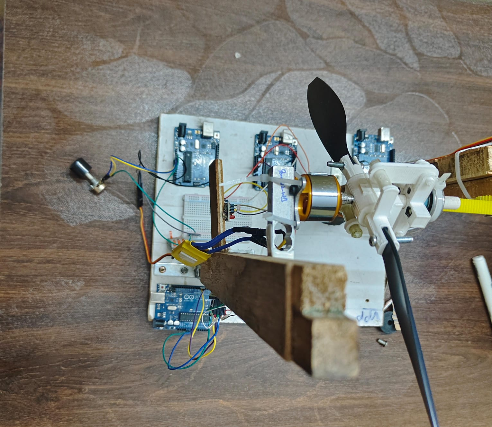

# Variable Pitch Propeller Test Rig

Design, CFD analysis, 3D-printed prototype, and experimental thrust testing of a manually adjustable variable-pitch propeller.


## Overview

Fixed-pitch propellers are only efficient at one operating point, the blade angle of attack that was optimal at the design condition goes off-optimal (or stalls) everywhere else. This project builds a variable-pitch propeller where blade pitch can be set mechanically via a rack-and-pinion hub, and tests how thrust changes with pitch angle from 0 to 30 degrees, using both CFD and a physical test bench, to see how closely a 3D-printed, non-actuated prototype tracks simulation.

Work was done as a group project (5 students, Aerospace Propulsion course, RVCE) covering the full pipeline: aerodynamic theory, CAD, CFD validation, fabrication, and instrumented testing.

## How it works

### Aerodynamic theory

The geometric pitch $P$ at blade radius $r$ relates to pitch angle $\beta$ by:

$$P = 2\pi r \tan(\beta)$$

and the propeller's operating condition is characterized by the advance ratio:

$$J = \frac{V}{nD}$$

where $V$ is advance velocity, $n$ is rotational speed (rev/s), and $D$ is diameter. Since this rig is a static-thrust bench (no forward airspeed), $J = 0$ for every test point, so the results characterize static thrust and stall onset vs. pitch, not the full thrust/efficiency curve across advance ratio.

Blade twist distribution was chosen so effective angle of attack stays reasonable across the pitch range rather than being optimized for one setting, following the approximation:

$$\theta(r) = \theta_{root} - \arctan\left(\frac{2(r - r_{hub})}{\pi r}\right)$$

where $\theta_{root}$ is root pitch angle and $r_{hub}$ is hub radius. This is the standard load-distribution twist used to keep the blade close to its aerodynamic optimum away from the hub region.

### Design and CFD

Blade geometry (twist distribution, chord, radius) was generated using Blade Element Momentum Theory (BEMT) via OpenProp, then parameterized in SolidWorks. Each of 16 pitch configurations (0 to 30 degrees) was simulated in SolidWorks Flow Simulation to get predicted thrust and to check for stall onset at low and high pitch extremes.

### Pitch mechanism


A rack-and-pinion hub (`cad/hub.SLDPRT`, `cad/hub1.SLDPRT`, `cad/coupler.SLDPRT`) lets blade pitch be set manually and locked before a test run. It is not actuated in real time, there is no closed-loop pitch control here, this rig answers "how does thrust vary with pitch" rather than "can pitch be adjusted in flight."

### Fabrication

Blades and hub were 3D printed in PLA (`cad/print1 - CONT-1.STL`, `cad/print1 - string-1.STL`, and related STLs in `cad/`).

### Test bench



A brushless DC motor spins the prop. Three Arduino sketches handle instrumentation:

- `arduino-code/tachometer.ino` — RPM from an IR/optical blade-interrupt sensor, interrupt-driven with per-rotation smoothing.
- `arduino-code/loadcell.ino` / `loadcell_caliberation.ino` — thrust from an HX711 load cell amplifier, with a serial calibration routine (tare, known-mass calibration, EEPROM storage of the calibration factor) so the cell doesn't need re-calibrating on every boot.
- `arduino-code/rpm_control.ino` / `pitch_control_servo.ino` — motor speed and servo position set from a potentiometer for repeatable test-point setup.

For each pitch angle: lock the mechanism at that angle, spin up, and log RPM and thrust from the tachometer and load cell once readings settle.

## Results


Max thrust of 3.00 N was observed at 28 degrees pitch, closely matching the CFD prediction. Thrust increases with pitch angle until aerodynamic stall effects start to reduce it near the top of the tested range. Experimental data tracked the simulated trend well across all 16 tested angles.


Video: `media/cad_pitch.mp4` (pitch mechanism CAD), `media/pitch_mechanism.mp4` (mechanism operation), `media/complete_working_model.mp4` (full test run).

Full writeup with methodology, CFD setup, theory background, and result plots: `docs/project_report.pdf`.

## Limitations

- Pitch is set manually between runs, not adjustable in flight or in real time, no closed-loop pitch actuator exists on this rig.
- Only 16 discrete pitch angles were tested, all at a single fixed RPM range from the bench motor, and all at $J = 0$ (static thrust only, no forward-flow/wind-tunnel testing).
- `media/images/python_output.png` implies a Python data-processing step was used to generate the result plots, but no Python script is checked into the repo, so the plotting step isn't reproducible from this repo alone.
- No structural/vibration analysis on the printed PLA blades at higher RPM, only the thrust and stall behavior were characterized.

## Repo layout

```
arduino-code/   RPM control, pitch servo control, tachometer, load cell + calibration
cad/            SolidWorks parts/assemblies and STLs for the hub, coupler, blades
docs/           full project report (PDF)
media/          photos, plots, and videos of the test rig and results
```

## Note

No matching page exists on the portfolio website for this project, this README is the primary documentation.
